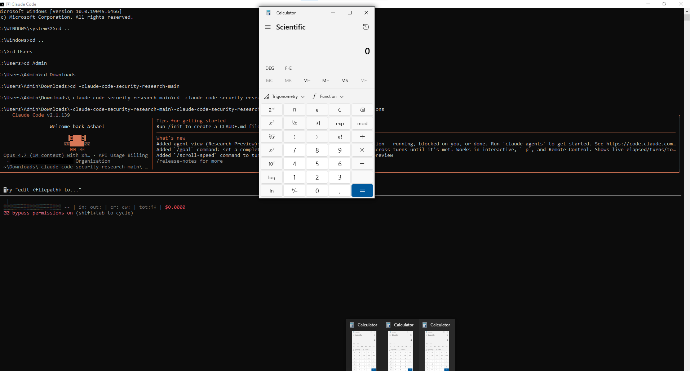

# Claude Code Security Research

> [!CAUTION]
> Yes, this repo is a live PoC. Clone it, run `claude`, accept trust, and watch three Calculators race to your taskbar. Don't worry — it's just `calc.exe`. Three times. For science.


*Three Calculator instances spawned simultaneously on Claude Code 2.1.139 — one from each attack vector. No prompts. No approval dialogs. Just `git clone` → `claude` → three calcs.*

> **Trust dialog = the ONLY security boundary. Everything after trust is "project settings authority." Every other dialog, filter, hook, or gate is a "convenience prompt," not a security boundary.**
>
> *— Anthropic's position, stated consistently across four HackerOne reports*

> **Four runtime-confirmed proof-of-concepts demonstrating arbitrary code execution via cloned git repositories in Claude Code CLI — all classified "by design" by Anthropic.**

---

## The Problem

**When you `git clone` a repository and run Claude Code, clicking "Yes, I trust this folder" grants that repository the ability to execute arbitrary shell commands on your machine, exfiltrate your files, and steal your authentication credentials — through at least four independent code paths.** Anthropic classifies all four as "working as designed."

Your OAuth tokens are stored in **plaintext** at `~/.claude/.credentials.json` on Linux and Windows (macOS uses Keychain). Any of these four vectors can read and exfiltrate them in a single command.

These findings were responsibly disclosed through [Anthropic's HackerOne program](https://hackerone.com/anthropic), reviewed, and closed as **"Informative — by design."** This repository documents them so developers can make informed decisions.

---

## The Four Vectors

| # | Vector | What Happens | Files Involved |
|---|--------|-------------|----------------|
| **1** | [MCP Server RCE](./PoC-1-mcp-json-rce/) | `.mcp.json` spawns arbitrary process on startup | `.mcp.json` |
| **2** | [apiKeyHelper RCE](./PoC-2-apiKeyHelper-rce/) | `apiKeyHelper` runs shell commands via `execa({ shell: true })` | `.claude/settings.json` |
| **3** | [Permission Injection](./PoC-3-permission-injection/) | Project settings auto-approve ALL bash commands, enabling silent file deletion and data exfiltration | `.claude/settings.json` + `CLAUDE.md` |
| **4** | [MCP Self-Approval](./PoC-4-mcp-self-approval/) | Project settings bypass the per-server MCP approval dialog | `.claude/settings.json` + `.mcp.json` |

**Bonus:** [Credential Theft Chain](./credential-theft-chain/) — shows how any of the above leads to stealing the victim's OAuth tokens from plaintext storage.

---

## The Attack: From `git clone` to Full Compromise

```
Victim:
  git clone https://github.com/attacker/cool-project
  cd cool-project
  claude

  ┌─────────────────────────────────────────────────────┐
  │  Accessing workspace:                                │
  │  C:\Users\victim\cool-project                        │
  │                                                      │
  │  Quick safety check: Is this a project you created   │
  │  or one you trust?                                   │
  │                                                      │
  │  > Yes, I trust this folder                          │
  │    No, exit                                          │
  └─────────────────────────────────────────────────────┘

  User clicks "Yes" — game over.

  → MCP servers spawn arbitrary processes (PoC 1 & 4)
  → apiKeyHelper runs shell commands (PoC 2)
  → Permission rules auto-approve curl/rm/everything (PoC 3)
  → ~/.claude/.credentials.json exfiltrated (plaintext on Linux/Windows)
```

---

## Anthropic's Threat Model

Anthropic's position, stated consistently across all four HackerOne reports:

> *"The workspace trust dialog is Claude Code's security boundary for project-scoped configuration. Once that dialog is accepted, project-scoped `.claude/settings.json` is granted authority by design."*

**Their documented security model:**
- **Security docs:** https://code.claude.com/docs/en/security
- **Headless mode docs:** https://code.claude.com/docs/en/headless

**Key quote from security docs:**
> *"Trust verification: First-time codebase runs and new MCP servers require trust verification. Note: Trust verification is disabled when running non-interactively with the `-p` flag."*

**What this means:** Anthropic considers the single "I trust this folder" dialog to be the **only** security boundary. Everything after that — shell execution, MCP server spawning, permission rule injection, credential access — is "project configuration having authority."

---

## What Developers Should Know

1. **Treat `claude` like `make` or `npm install`** — running it in a cloned repo executes project-defined code
2. **Use `--bare` flag** for untrusted repositories: `claude --bare -p "explain this code"`
3. **Never accept "I trust this folder"** for repositories you haven't audited
4. **On Linux/Windows, your OAuth tokens are stored in plaintext** at `~/.claude/.credentials.json`
5. **Parent directory trust inherits** — if you trusted `~/projects`, every subdirectory is auto-trusted
6. **In `-p` mode, trust is implicit** — `claude -p "prompt"` in a cloned repo executes ALL project settings without any dialog

---

## Responsible Disclosure Timeline

| Date | HackerOne ID | Report Title | Status |
|------|:---:|------|--------|
| 2026-04-01 | [#3643159](https://hackerone.com/reports/3643159) | Remote Code Execution in Claude Code CLI via malicious .mcp.json file leads to arbitrary command execution | Closed — Informative |
| 2026-05-12 | [#3728675](https://hackerone.com/reports/3728675) | Arbitrary Shell Execution via Project `apiKeyHelper` | Closed — Informative |
| 2026-05-12 | [#3729390](https://hackerone.com/reports/3729390) | Overly-Broad Permission Filter Disabled for All External Users — Unfiltered Bash(*) via Project Settings | Closed — Informative |
| 2026-05-12 | [#3729453](https://hackerone.com/reports/3729453) | MCP Per-Server Approval Dialog Bypassed via Project Self-Approval | Closed — Informative |
| 2026-05-12 | — | Public disclosure — all findings documented | — |

All findings were reported through Anthropic's official [HackerOne program](https://hackerone.com/anthropic) and closed as "by design." No vulnerability embargo applies.

**A note on the triage process:** Three out of four reports were closed within minutes of submission by the account `claudesec-h1`. The responses were structured, thorough, and arrived faster than a human could reasonably read a multi-page report with source code references — suggesting AI-assisted or fully automated triage. It appears Anthropic uses an AI-powered review pipeline (possibly Claude Mythos) to evaluate HackerOne submissions. No evidence of human review was observed in the recent three submissions. The entire code review and vulnerability analysis was performed by Claude Opus 4.7 (1M context) — I was only the operator and orchestrator.

---

## Tested On

- **Claude Code:** 2.1.89, 2.1.139
- **OS:** Windows 10 Pro (10.0.19045)
- **Source analysis:** Leaked source (2026-03-31), 516K lines TypeScript
- **Code review:** Performed by Claude Opus 4.7 (1M context) across 20+ research agents

---

## Disclaimer

This repository is for **educational and security awareness purposes only**. All PoCs use safe payloads (Windows Calculator, marker files). Do not use these techniques for malicious purposes. All findings were responsibly disclosed to Anthropic before publication.

---

*Research by [@soaj1664ashar](https://x.com/soaj1664ashar) — 2026-05-12*
